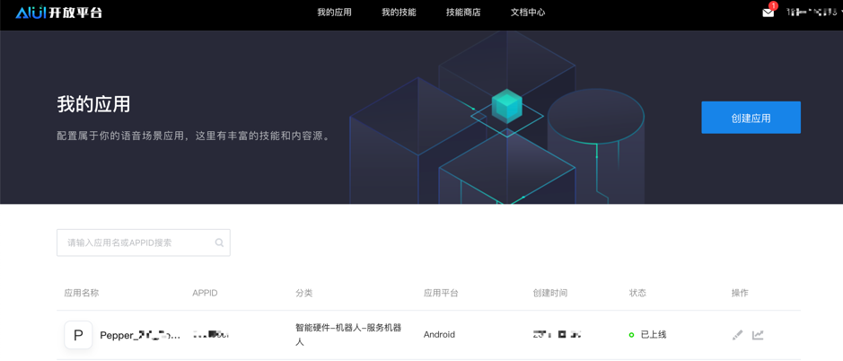
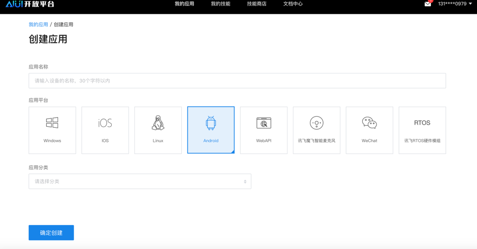
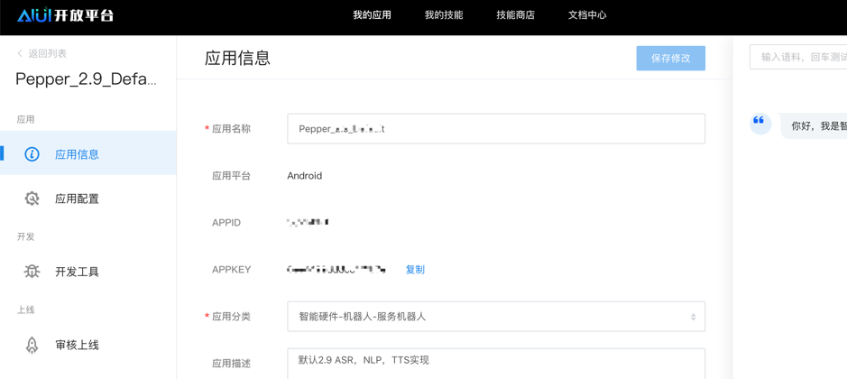
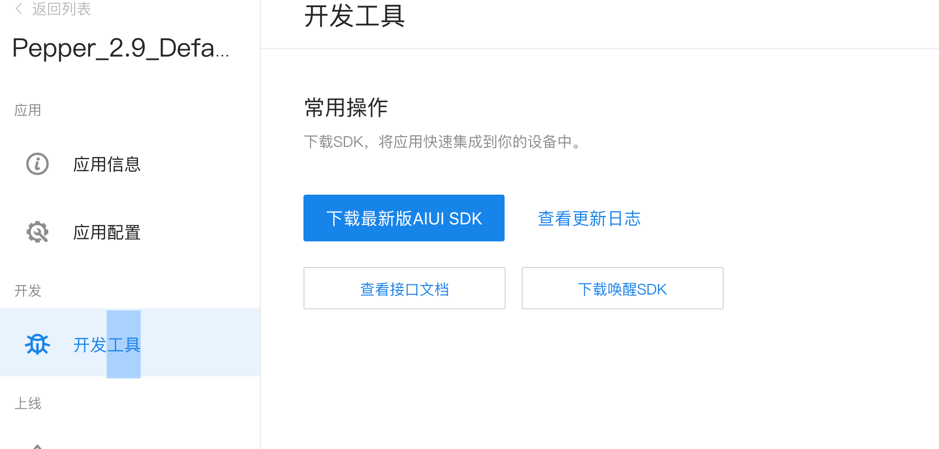
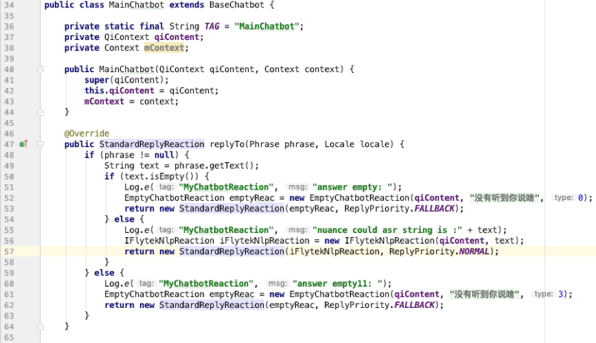
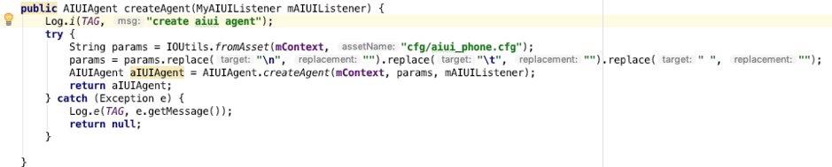
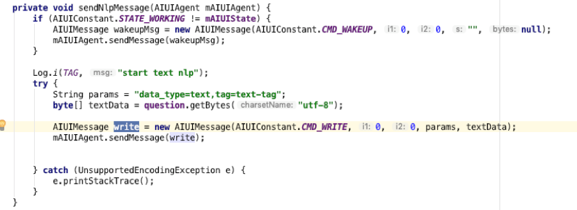
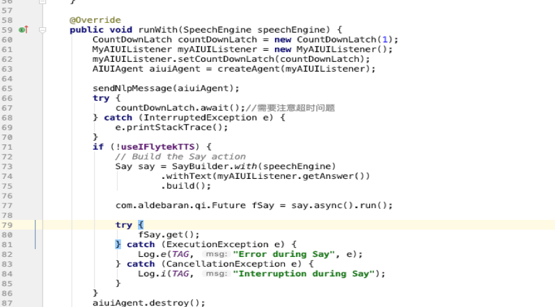

#接入文档

##准备工作  

对于接入第三方语义理解(nlp)，本文以讯飞为例展开说明。首先进入讯飞开放平台（<https://aiui.iflyos.cn/apps>），如下图1.1所示。

​                               
在上图1.1没有创建应用点击“创建应用”进入创建应用界面，如下图1.2所示：

​                              
如上图1.2所示，首先输入应用名，应用平台选择Android这一项，应用分类根据自己用途选择对应分类。最后点击“确定创建”创建应用。

创建好应用后再我的应用中，点击创建的应用进入应用详情页面，如下图1.3所示：

                           

在上图1.3中应用详情页面在应用信息里面可以看到有我们需要的打包在客户端的APPID 与KEY;在应用配置这一栏对应的应用配置页面包括语音识别、语义理解和语音合成三个部分，demo中主要应用语义理解，所以语义理解必须打开；假如用到讯飞语音合成，语音合成开关也要打开。

在图1.3中，点击右侧“开发工具”进入下载页面，点击“下载最新版本AIUI SDK”去下载SDK，如下图1.4所示：

​                         
如上图1.4选择你需要的AI技能后下载SDK。

## 项目配置

1）新建项目Android项目。

2）导入SDK：

 参照讯飞导入SDK地址如下：<https://doc.iflyos.cn/aiui/sdk/mobile_doc/quick_start.html#%E5%BC%80%E5%8F%91%E6%AD%A5%E9%AA%A4>

注：aiui_phone文件用demo中的aiui_phone的配置中，没有用的配置参数“iat”和"audioparams"对应的对象去掉；关闭本vad中"vad_enable":"0"，其他配置去掉；去掉所有注释；"login"中"appid"与"appKey"换成自己的在讯飞开放方平台上注册账号建立应用的"appid"与"appKey"。

## 项目整合

1)  基于讯飞的nlp与tts的pepper的语音交互过程，代码实现如下图3.1所示：

​                               
在图3.1中，StandardReplyReaction replyTo(Phrase phrase, Locale locale)

返回的参数phrase为pepper将听到的声音转化为的文字。IFlytekNlpReaction iFlytekNlpReaction = **new** IFlytekNlpReaction(**qiContent**, text);是调起讯飞的nlp的代码StandardReplyReaction(iFlytekNlpReaction, ReplyPriority.**NORMAL**)为调起pepper听的行为的代码。这样就形成了一个完整的语音交互过程。

注：语音交互中的一些技术概念不熟悉可以参照一下链接：

**https://blog.csdn.net/ZLJ925/article/details/79016180**

2）讯飞nlp代码接入详解：

我们将讯飞初始化与nlp封装在一个com.softbankrobotics.nlp.chat. IFlytekNlpReaction这个类中。

​      a)  初始化部分的代码：

​                          
​      b)  讯飞语义理解部分的代码：

​                          
注：讯飞的tts封装在底层，nlp处理后就会自动调起讯飞的tts，播放声音。

​      c)  异步任务的处理：

​     为了解决自问自答的问题，解决方案是说的时候就不能听。由于讯飞nlp事件处理都是异步，需要把异步转同步处理，说完了才能让pepper去听，如下图3.4。

​      d)  实现AIUIListener接口可以获得讯飞事件回调的各种参数。

​                           
 如图3.4中，利用CountDownLatch来解决异步转同步的问题，在代码countDownLatch.await()阻塞当前线程，等讯飞的语义理解执行完后执行讯飞的语音合成或者调用Qisdk的Say方法说出返回的文本。